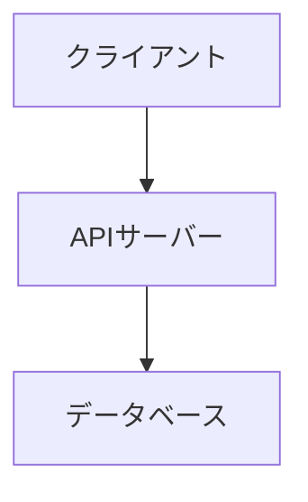

# システム構成書の作り方

システム全体のアーキテクチャ構成・環境構成・サービス構成・DB接続をまとめた文書。
画面の有無に関わらず**必ず作成する**（旧「基本設計書」のうち画面に関係しない部分）。

---

## テンプレート

以下をコピーして値を埋める。Mermaidブロックは半角バッククォート3つ（` ``` `）で囲む。

````markdown
# システム構成書

[← ドキュメント一覧に戻る](./index.md)

---

## 1. システム構成図

[テキストで構成を説明 / Mermaidで図示]



## 2. 環境構成・サービス構成・DB接続

### 2.1 環境構成

| 区分 | 技術 / サービス名 | バージョン | 用途 |
|------|----------------|-----------|------|
| 言語 | | | |
| フレームワーク | | | |
| Webサーバー | | | |
| アプリケーションサーバー | | | |

### 2.2 サービス構成

| 区分 | 技術 / サービス名 | バージョン | 用途 |
|------|----------------|-----------|------|
| 認証サービス | | | |
| ストレージ | | | |
| メール配信 | | | |
| 外部API | | | |

> 利用していないサービスの行は削除すること。

### 2.3 DB接続

| 項目 | 内容 |
|------|------|
| DBエンジン | （例：PostgreSQL 15） |
| 接続方式 | （例：接続プール / 直接接続） |
| 主なORM / クエリビルダー | （例：ActiveRecord / SQLAlchemy） |
````

---

## 更新時の手順: 旧形式（単一ファイルの `docs/基本設計書.md`）からの移行

`docs/システム構成書.md` が無く、代わりに旧い単一ファイル `docs/基本設計書.md`
（システム構成図・画面設計が1ファイルにまとまった形式）が見つかった場合、
**「更新して」という指示であっても、まずこの移行を行う。**

1. 旧ファイルの「システム構成図」「環境構成・サービス構成・DB接続」セクションを
   `docs/システム構成書.md` として保存する
2. **旧ファイルはまだ削除しない。** 画面部分（画面一覧・画面フロー・画面別詳細等）の移行は
   `references/画面設計書.md` 側の手順で行う。両方の移行が終わったタイミングで
   画面設計書側が削除確認・削除を行う
3. 移行した旨をユーザーに報告する（例：「基本設計書.md からシステム構成書.md を切り出しました。
   続けて画面設計書の移行を行います」）

---

## この仕様書の記載漏れチェック観点

- システム構成図に主要なコンポーネント（クライアント・APIサーバー・DB・外部サービス）が漏れなく含まれているか
- 技術情報が「環境構成・サービス構成・DB接続」の3区分で記載されているか
- 実際に使われている外部サービス（認証・ストレージ・メール配信・外部API等）が漏れていないか
- 旧形式の単一ファイル `docs/基本設計書.md` が見つかった場合、移行してから（削除せず）画面設計書側の移行に引き継いでいるか
