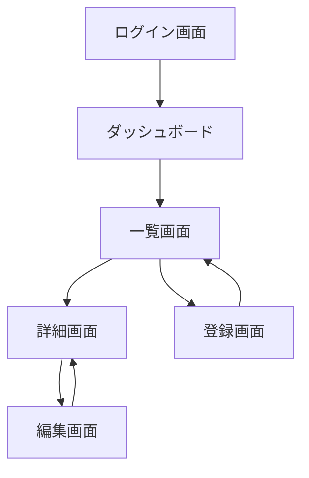
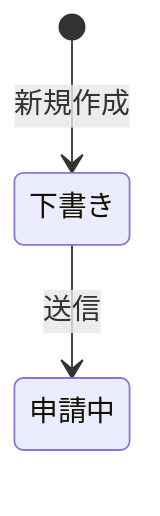
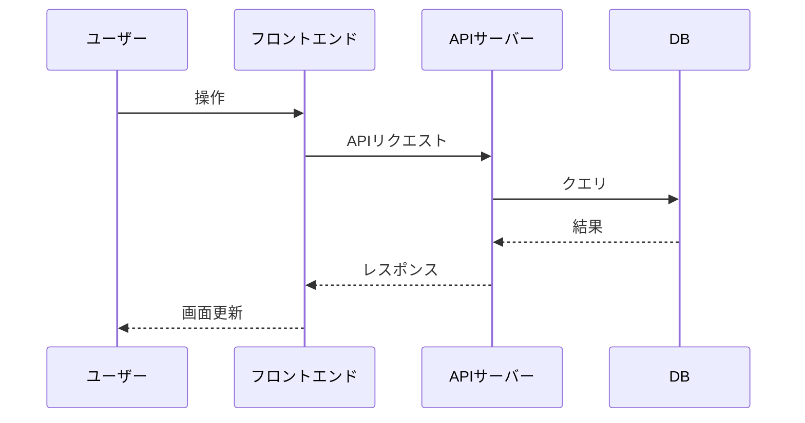

# 画面設計書の作り方

画面の一覧・画面間の遷移・画面ごとの詳細仕様・主要なデータフローをまとめた文書（旧「基本設計書」のうち画面に関する部分）。

> [!IMPORTANT]
> **画面が無いシステム（APIのみ・バッチ処理など）の場合、このドキュメント自体を作成しない。**
> 画面の有無はソースコード（テンプレートファイル・コンポーネント・ルーティング定義）から判断する。

他の仕様書と異なり、**単一ファイルではなくフォルダ構成**にする。

```
docs/画面設計書/
├── index.md              # 画面一覧・画面フロー・ステータス定義・データフロー
├── P01_ログイン画面.md     # 画面ごとの詳細（1画面1ファイル）
├── P02_ダッシュボード.md
├── images/               # 画面ごとのスクリーンショット（取得できた場合のみ）
│   ├── P01_ログイン画面.png
│   └── ...
└── ...
```

ファイル名は `<No>_<画面名>.md`（例：`P01_ログイン画面.md`）。画面名にファイル名として不適切な記号（`/`など）が含まれる場合は適宜省略・置換する。

また、**一括生成しない**。「画面一覧を確定させてから、1画面ずつ詳細を作る」という2段階の手順を踏む。
理由は、画面数が多いプロジェクトでは一覧の時点での誤り・漏れ・不要な画面の混入に気づきにくく、
後から気づくと手戻りが大きいため。フォルダ構成にすることで、画面ごとの作成・確認がそのまま
「1ファイルの作成・確認」に対応し、更新のときも他の画面のファイルに影響を与えずに済む。

---

## 新規作成時の手順

### D-STEP 1: 画面一覧の作成とユーザー確認

1. 画面を洗い出し、以下の一覧表を作る（ファイル名の列も決めておく）。
   実装コードがあればルーティング定義・ページコンポーネント・テンプレートファイルから洗い出す。
   **開発前モード**（実装コードがまだ無い場合）は、企画書・ワイヤーフレームがあればそこから洗い出し、
   無ければユーザーに「作る予定の画面を教えてください」と質問して洗い出す。

   | No | 画面名 | ルート (URL) | 認証 | 概要 |
   |----|--------|------------|------|------|
   | P01 | [画面名] | `/path` | 要/不要 | [概要] |

2. この一覧を**ユーザーに提示して確認を取る**。「この画面一覧で合っていますか？　過不足があれば教えてください」と聞く。
3. ユーザーからの追加・削除・修正指示があれば一覧に反映し、確定するまで繰り返す。

> [!NOTE]
> この時点ではまだファイルは1つも保存しない（画面一覧のドラフトを見せるだけ）。保存はD-STEP 2・3で行う。

### D-STEP 2: 画面ごとの詳細作成（1画面ずつ、確定したらすぐファイルに保存）

画面一覧が確定したら、**No順に1画面ずつ**、以下のフォーマットで詳細を作成する。

#### スクリーンショットの取得（概要の下に配置。ユーザーが要望した場合のみ）

> [!NOTE]
> スクリーンショットの取得は**オプトイン**。ユーザーが「スクリーンショットを配置して」
> 「画面のキャプチャも入れて」等と明示的に要望したときだけ行う。何も言われなければ
> 通常どおり画像無しで作成し、無理に探しにいかない。

要望があった場合は、概要を書いたら、その画面を確認できるものがないか探し、**概要の直下**に配置する。
それでも見つからなければ無理に作らず省略してよい（`[要確認]` にする必要もない、単に無いだけの扱い）。

1. **まず既存のモック画像・HTMLモックを探す**（優先）。企画資料・デザインファイル・Figmaエクスポート等の
   フォルダにその画面のモック（png/jpg/svg/HTML等）が無いか探す。見つかったら
   `docs/画面設計書/images/<No>_<画面名>.<拡張子>` にコピーして使う。
2. **モックが見つからない場合のみ**、アプリが実際に動かせそうであれば
   （package.json等からdev serverコマンドが分かる等）、**ユーザーに「開発サーバーを起動してこの
   画面のスクリーンショットを撮ってもよいか」を確認する**。OKが出たらPreview系ツール
   （`preview_start` → 対象ルートへ `navigate` → `preview_screenshot`）で撮影し、
   `docs/画面設計書/images/<No>_<画面名>.png` として保存する。
   - この確認は最初の1回だけでよい（同じ作業の中で複数画面を撮る場合、画面ごとに聞き直さない）
   - ログインや複雑な前提操作が無いと辿り着けない画面は、無理に再現しようとせずスクリーンショット無しで進めてよい
3. どちらも無ければスクリーンショットは省略する。

```markdown
# P01: [画面名]

[← 画面設計書一覧に戻る](./index.md)

**最終更新**: YYYY-MM-DD  
**バージョン**: v1.0

---

- **ルート**: `/path`
- **認証**: 要 / 不要
- **概要**: この画面の目的・用途


**表示仕様**（一覧・テーブル表示がある場合）

| 項目 | 仕様 |
|------|------|
| 1ページあたりの表示件数 | 〇件（ページネーションあり / なし） |
| 初期ソート順 | [カラム名] の [昇順 / 降順] |
| ソート可能なカラム | [カラム名A]、[カラム名B] |
| 検索・絞り込み | [条件1]、[条件2] |
| その他 | （例：チェックボックスで複数選択して一括削除できる） |

**表示機能**

| No | 機能名 | 概要 |
|----|--------|------|
| | | |

**操作機能**

| No | 操作名 | トリガー | 処理概要 | 遷移先 |
|----|--------|---------|---------|--------|
| | ボタン名・リンク名など | クリック / 入力 / 送信 | | |

**使用API / バックエンド処理**

| メソッド | エンドポイント | 用途 |
|---------|-------------|------|
| GET | `/api/xxx` | [データ取得の目的] |
| POST | `/api/xxx` | [送信内容] |

**入力バリデーション**（入力フォームがある場合のみ記載）

> 入力項目が存在しない画面はこのセクションを省略する。

| No | 項目名 | 入力種別 | 必須 | 型・形式 | 文字数・範囲 | その他ルール | エラーメッセージ例 |
|----|--------|---------|------|---------|------------|------------|----------------|
| V01 | [項目名] | テキスト / セレクト 等 | ✅ / - | 文字列 / 数値 / 日付 / メール等 | 最大〇文字 / 〇〜〇 | 重複不可 / 半角のみ 等 | 「〇〇を入力してください」 |

**CSV入出力がある場合**（一覧のCSVダウンロード・CSVインポート等）

> 文字コード・必須カラム・エラー時の挙動などの技術仕様はここには書かない。
> `docs/詳細設計/CSV_<CSV名>.md` に書き、ここではUIレベルの記載だけに留める。

- この画面に「CSVインポートボタンがある」「一覧をCSV出力できる」等の事実だけを記載する
- 対応する詳細設計のCSVファイルへリンクする（例：[詳細設計/CSV_会員インポート.md](../詳細設計/CSV_会員インポート.md)）
```

1画面分の内容をユーザーに提示し「この内容でよいですか？　次の画面に進めてよければ教えてください」と確認する。
OKが出たら **`docs/画面設計書/P01_[画面名].md` として保存**してから、次の画面（P02...）に進む。修正指示があれば直して再提示する。

> [!TIP]
> **エスケープハッチ**: 途中でユーザーが「残りはまとめて作って」のように言った場合、
> それ以降は確認を挟まず残りの画面をまとめて作成・保存してよい。無理に1画面ずつ確認を続けない。

### D-STEP 3: 全画面完了後に index.md を保存

全画面のファイルを保存し終えたら、`docs/画面設計書/index.md` を作成する。

```markdown
# 画面設計書

[← ドキュメント一覧に戻る](../index.md)

**最終更新**: YYYY-MM-DD  
**バージョン**: v1.0

---

## 1. 画面一覧

| No | 画面名 | ルート (URL) | 認証 | 概要 | 詳細 |
|----|--------|------------|------|------|------|
| P01 | [画面名] | `/path` | 要/不要 | [概要] | [P01_画面名.md](./P01_画面名.md) |

## 2. 画面フロー

画面間の遷移をMermaidで図示する。



> ログインが必要な画面は認証チェック → 未認証の場合はログイン画面へリダイレクトする流れも記載すること。

## 3. ステータス定義（ステータスを持つデータがある場合のみ記載）

> 注文・申請・タスクなどステータスが変化するデータがある場合に記載する。
> ステータスを持つデータが存在しない場合はこのセクションを省略する。

#### [対象データ名]（例：注文・申請・タスク）

| ステータス値 | 表示名 | 意味 |
|-----------|--------|------|
| `draft` | 下書き | 作成中で未送信の状態 |
| `submitted` | 申請中 | 送信済みで承認待ちの状態 |

**ステータス遷移図**



## 4. データフロー

[主要な処理フローをMermaidのsequenceDiagramで記述]


```

`docs/index.md`（全体のドキュメント一覧）からは、このフォルダの `index.md`（`docs/画面設計書/index.md`）にリンクする。

---

## 更新時の手順（システム構成書など他の仕様書とは異なる）

### 0. 旧形式（単一ファイルの `docs/基本設計書.md`）からの移行

`docs/画面設計書/` フォルダが無く、代わりに旧い単一ファイル `docs/基本設計書.md`
（システム構成図・画面設計が1ファイルにまとまった形式）が見つかった場合、
**「更新して」という指示であっても、まずこの移行を行う。**（`references/システム構成書.md`
側で先にシステム構成部分の移行が行われている前提で進める。まだなら先にそちらを行う）

1. 旧ファイルの「画面一覧」「画面フロー」「ステータス定義」「データフロー」を
   `docs/画面設計書/index.md` に、画面ごとの「画面別詳細」を `P01_画面名.md` 等に分割して保存する
   （1画面ずつの確認は不要。移行なのでまとめて行ってよい）
2. 旧ファイルにCSVインポートの技術仕様が書かれていれば、`docs/詳細設計/CSV_<CSV名>.md` に移し、
   ここにはUIレベルの記載＋リンクだけを残す（`references/詳細設計書.md` 参照）
3. `docs/システム構成書.md` への移行も完了していることを確認したうえで、
   元の `docs/基本設計書.md` を削除してよいかユーザーに確認してから削除する
4. 移行した旨（何画面分のファイルに分割したか）をユーザーに報告する

### 通常の更新

画面設計書は「新規画面」「既存画面の変更」「画面の削除」の3パターンを区別して扱う。ファイルが画面ごとに
分かれているため、更新は該当ファイルだけを触ればよく、他の画面のファイルには一切手を加えない。

1. ソースコードの変更箇所（ルーティング・ページコンポーネント）から、画面の追加・変更・削除を検出する
2. **新規に増えた画面**: D-STEP 1〜2 と同様に、まず一覧への追加をユーザーに確認し、OKなら1画面ずつ
   詳細を作成して都度確認したうえで、新しいファイル（`P0X_画面名.md`）として保存する
   （スクリーンショットの要望が出ている場合はD-STEP 2の取得手順も同様に行う。最終更新・バージョンは `v1.0`）
3. **既存画面の内容変更**（表示項目・API・バリデーション等の変更）: ユーザーに確認を挟まず、
   該当する `P0X_画面名.md` だけを自動的に上書き更新する（他の画面のファイルには触れない）。
   その画面ファイルの **最終更新日を今日の日付に、バージョンを1つ上げる**（v1.0 → v1.1）。
   スタンプが無い場合は追加する。スクリーンショットはそもそもオプトインなので、既存画面の自動更新では
   触れない（見た目が大きく変わった場合のみ、ユーザーから要望があれば個別に撮り直す）
4. **削除された画面**: 対応する `P0X_画面名.md` を削除し、`index.md` の画面一覧からもその行を削除する
   （「廃止」として残さない。画面設計書は現在のシステムの姿を正確に表すことを優先する）
5. いずれの場合も最後に `docs/画面設計書/index.md` の画面一覧・（該当すれば画面フロー等）と、
   `index.md` 自身の最終更新日・バージョンを更新する。変更内容は `docs/変更履歴.md` に記録する
   （`references/変更履歴.md` 参照）

### 「レイアウトを最新にして」と言われた場合（コード変更が無い場合）

コード側の変更点が無く、レイアウトの整合性だけを確認・修正してほしいと言われた場合は、
上記の「新規画面の検出」は行わず、`docs/画面設計書/index.md` と**既存の全 `P0X_画面名.md`** を
1つずつ次の観点でチェックする（画面数が多くても全件チェックする。内容の書き換えは行わない）：

- `**最終更新**: YYYY-MM-DD` / `**バージョン**: vX.X` のスタンプがあるか。無ければ追加する
  （経緯が分からない場合は今日の日付・`v1.0` から追跡を開始する）
- ファイル自体に `## 変更履歴` のようなセクションが残っていないか。残っていれば
  `references/変更履歴.md` の移行手順に従い `docs/変更履歴.md` に移してから削除する

一致していたファイルには触れない。実際に直したファイルだけ最終更新日・バージョンを更新し、
`docs/変更履歴.md` に「画面設計書のレイアウトを最新化」のように短く記録する。

---

## この仕様書の記載漏れチェック観点

- ルーティング定義にある全画面が `index.md` の画面一覧に記載され、対応するファイルが存在するか
- 各画面の操作・API呼び出しに漏れがないか
- 画面フロー（遷移図）が記載されているか
- ステータスを持つデータがある場合、ステータス定義と遷移図が記載されているか
- 一覧表示がある画面に表示仕様（件数・ソート・検索条件等）が記載されているか
- 入力フォームがある画面に入力バリデーションが記載されているか
- CSV入出力がある画面は、UIレベルの記載と詳細設計側CSVファイルへのリンクがあるか（技術仕様まで書き込んでいないか）
- 更新時、削除された画面のファイルと `index.md` の行が両方消えているか
- 旧形式の単一ファイル `docs/基本設計書.md` が見つかった場合、フォルダ構成に移行してから削除確認を取っているか（旧形式のまま追記していないか）
- スクリーンショットは、ユーザーが要望していないのに探しに行っていないか（オプトイン）
- 要望があった場合、モック画像または開発サーバーで取得したスクリーンショットが概要の直下に配置されているか
- 開発サーバーを起動してスクリーンショットを撮る前に、ユーザーへの確認を取っているか
