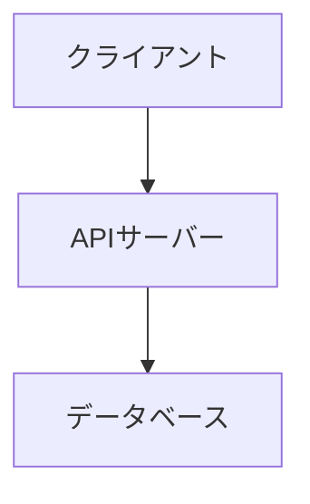

# システム構成書の作り方

システム全体のアーキテクチャ構成・環境構成・サービス構成・DB接続をまとめた文書。
画面の有無に関わらず**必ず作成する**（旧「基本設計書」のうち画面に関係しない部分）。

---

## テンプレート

以下をコピーして値を埋める。Mermaidブロックは半角バッククォート3つ（` ``` `）で囲む。

````markdown
# システム構成書

[← ドキュメント一覧に戻る](./index.md)

---

## 1. システム構成図

[テキストで構成を説明 / Mermaidで図示]



## 2. 環境構成・サービス構成・DB接続

### 2.1 環境構成

| 区分 | 技術 / サービス名 | バージョン | 用途 |
|------|----------------|-----------|------|
| 言語 | | | |
| フレームワーク | | | |
| Webサーバー | | | |
| アプリケーションサーバー | | | |

### 2.2 サービス構成

| 区分 | 技術 / サービス名 | バージョン | 用途 |
|------|----------------|-----------|------|
| 認証サービス | | | |
| ストレージ | | | |
| メール配信 | | | |
| 外部API | | | |

> 利用していないサービスの行は削除すること。

### 2.3 DB接続

| 項目 | 内容 |
|------|------|
| DBエンジン | （例：PostgreSQL 15） |
| 接続方式 | （例：接続プール / 直接接続） |
| 主なORM / クエリビルダー | （例：ActiveRecord / SQLAlchemy） |
````

---

## この仕様書の記載漏れチェック観点

- システム構成図に主要なコンポーネント（クライアント・APIサーバー・DB・外部サービス）が漏れなく含まれているか
- 技術情報が「環境構成・サービス構成・DB接続」の3区分で記載されているか
- 実際に使われている外部サービス（認証・ストレージ・メール配信・外部API等）が漏れていないか
