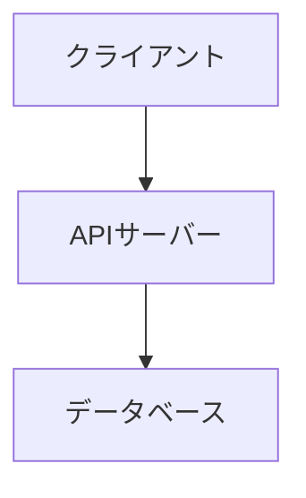
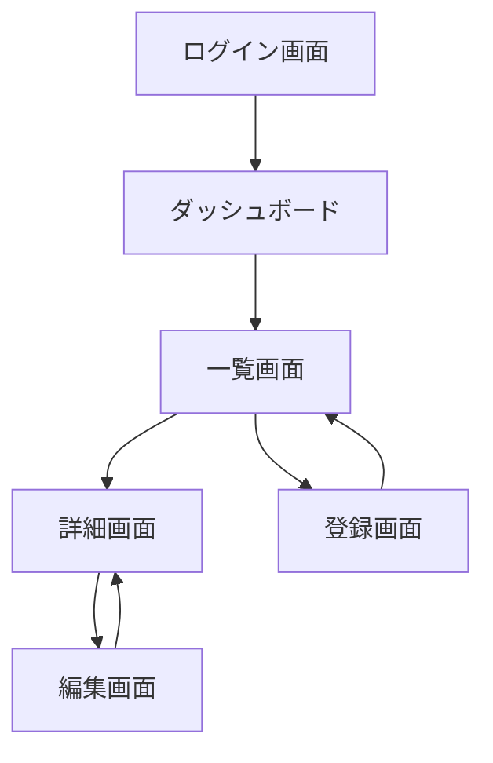
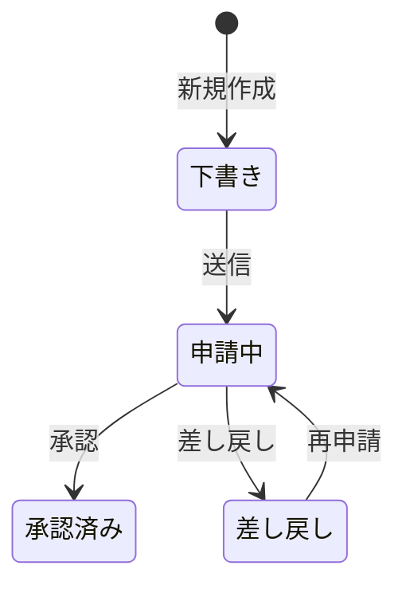
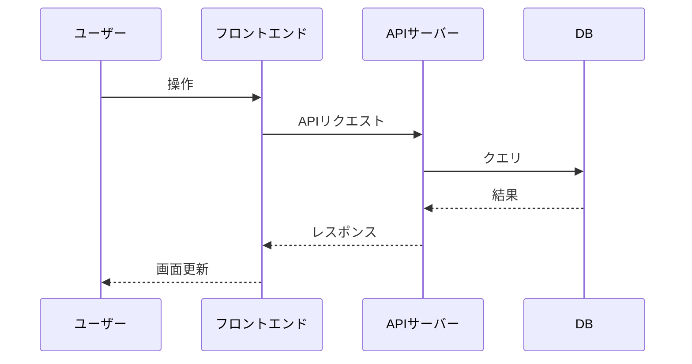

# 基本設計書の作り方

画面の構成・各画面でできる操作・システム全体の構成図をまとめた文書。

> **画面の有無で構成を切り替える：**
> - 画面あり（Webアプリ・フロントエンドあり）→ 「画面設計セクション」を含める
> - 画面なし（APIのみ・バッチ処理など）→ 「画面設計セクション」を省略する
>
> 画面の有無はソースコード（テンプレートファイル・コンポーネント・ルーティング定義）から判断する。

---

## テンプレート

以下をコピーして値を埋める。Mermaidブロックは半角バッククォート3つ（` ``` `）で囲む。

````markdown
# 基本設計書

[← ドキュメント一覧に戻る](./index.md)

---

## 1. システム構成図

[テキストで構成を説明 / Mermaidで図示]



## 2. 環境構成・サービス構成・DB接続

### 2.1 環境構成

| 区分 | 技術 / サービス名 | バージョン | 用途 |
|------|----------------|-----------|------|
| 言語 | | | |
| フレームワーク | | | |
| Webサーバー | | | |
| アプリケーションサーバー | | | |

### 2.2 サービス構成

| 区分 | 技術 / サービス名 | バージョン | 用途 |
|------|----------------|-----------|------|
| 認証サービス | | | |
| ストレージ | | | |
| メール配信 | | | |
| 外部API | | | |

> 利用していないサービスの行は削除すること。

### 2.3 DB接続

| 項目 | 内容 |
|------|------|
| DBエンジン | （例：PostgreSQL 15） |
| 接続方式 | （例：接続プール / 直接接続） |
| 主なORM / クエリビルダー | （例：ActiveRecord / SQLAlchemy） |

## 3. 画面設計（画面がある場合のみ）

### 3.1 画面一覧

| No | 画面名 | ルート (URL) | 認証 | 概要 |
|----|--------|------------|------|------|
| P01 | [画面名] | `/path` | 要/不要 | [概要] |

### 3.2 画面フロー

画面間の遷移をMermaidで図示する。



> ログインが必要な画面は認証チェック → 未認証の場合はログイン画面へリダイレクトする流れも記載すること。

### 3.3 ステータス定義（ステータスを持つデータがある場合のみ記載）

> 注文・申請・タスクなどステータスが変化するデータがある場合に記載する。
> ステータスを持つデータが存在しない場合はこのセクションを省略する。

#### [対象データ名]（例：注文・申請・タスク）

| ステータス値 | 表示名 | 意味 |
|-----------|--------|------|
| `draft` | 下書き | 作成中で未送信の状態 |
| `submitted` | 申請中 | 送信済みで承認待ちの状態 |
| `approved` | 承認済み | 承認が完了した状態 |
| `rejected` | 差し戻し | 差し戻されて修正が必要な状態 |

**ステータス遷移図**



### 3.4 画面別詳細

画面ごとに以下のフォーマットで記載する：

---

#### P01: [画面名]

- **ルート**: `/path`
- **認証**: 要 / 不要
- **概要**: この画面の目的・用途

**表示仕様**（一覧・テーブル表示がある場合）

| 項目 | 仕様 |
|------|------|
| 1ページあたりの表示件数 | 〇件（ページネーションあり / なし） |
| 初期ソート順 | [カラム名] の [昇順 / 降順] |
| ソート可能なカラム | [カラム名A]、[カラム名B] |
| 検索・絞り込み | [条件1]、[条件2] |
| その他 | （例：チェックボックスで複数選択して一括削除できる） |

**表示機能**

| No | 機能名 | 概要 |
|----|--------|------|
| | | |

**操作機能**

| No | 操作名 | トリガー | 処理概要 | 遷移先 |
|----|--------|---------|---------|--------|
| | ボタン名・リンク名など | クリック / 入力 / 送信 | | |

**使用API / バックエンド処理**

| メソッド | エンドポイント | 用途 |
|---------|-------------|------|
| GET | `/api/xxx` | [データ取得の目的] |
| POST | `/api/xxx` | [送信内容] |

**入力バリデーション**（入力フォーム・ファイルアップロード・CSVインポートがある場合のみ記載）

> 入力項目・ファイルアップロード・CSVインポートが存在しない画面はこのセクションを省略する。

| No | 項目名 | 入力種別 | 必須 | 型・形式 | 文字数・範囲 | その他ルール | エラーメッセージ例 |
|----|--------|---------|------|---------|------------|------------|----------------|
| V01 | [項目名] | テキスト / セレクト / ファイル / CSV | ✅ / - | 文字列 / 数値 / 日付 / メール等 | 最大〇文字 / 〇〜〇 | 重複不可 / 半角のみ 等 | 「〇〇を入力してください」 |

**CSVインポートの場合は以下も追記する：**

| 項目 | 内容 |
|------|------|
| 対応文字コード | UTF-8 / Shift-JIS 等 |
| ヘッダー行 | 必須 / 不要 |
| 最大行数 | 〇〇件まで |
| 必須カラム | カラム名A, カラム名B |
| エラー時の挙動 | 全件ロールバック / エラー行スキップ 等 |

---

（P02以降、同じフォーマットで繰り返す）

## 4. データフロー

[主要な処理フローをMermaidのsequenceDiagramで記述]


````

---

## この仕様書の記載漏れチェック観点

- ルーティング定義にある全画面が画面一覧に記載されているか
- 各画面の操作・API呼び出しに漏れがないか
- 技術情報が「環境構成・サービス構成・DB接続」の3区分で記載されているか
- 画面がある場合、画面フロー（遷移図）が記載されているか
- ステータスを持つデータがある場合、ステータス定義と遷移図が記載されているか
- 一覧表示がある画面に表示仕様（件数・ソート・検索条件等）が記載されているか
- 入力フォーム・ファイルアップロード・CSVインポートがある画面に入力バリデーションが記載されているか
