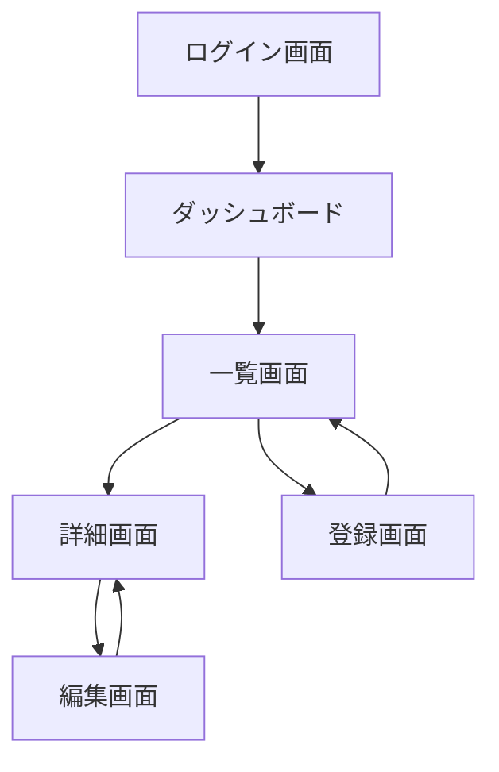
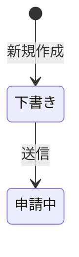
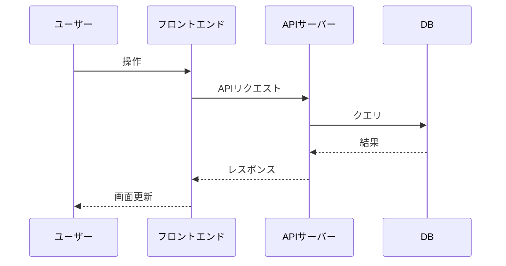

# 画面設計書の作り方

画面の一覧・画面間の遷移・画面ごとの詳細仕様・主要なデータフローをまとめた文書（旧「基本設計書」のうち画面に関する部分）。

> [!IMPORTANT]
> **画面が無いシステム（APIのみ・バッチ処理など）の場合、このドキュメント自体を作成しない。**
> 画面の有無はソースコード（テンプレートファイル・コンポーネント・ルーティング定義）から判断する。

他の仕様書と異なり、**単一ファイルではなくフォルダ構成**にする。

```
docs/画面設計書/
├── index.md              # 画面一覧・画面フロー・ステータス定義・データフロー
├── P01_ログイン画面.md     # 画面ごとの詳細（1画面1ファイル）
├── P02_ダッシュボード.md
└── ...
```

ファイル名は `<No>_<画面名>.md`（例：`P01_ログイン画面.md`）。画面名にファイル名として不適切な記号（`/`など）が含まれる場合は適宜省略・置換する。

また、**一括生成しない**。「画面一覧を確定させてから、1画面ずつ詳細を作る」という2段階の手順を踏む。
理由は、画面数が多いプロジェクトでは一覧の時点での誤り・漏れ・不要な画面の混入に気づきにくく、
後から気づくと手戻りが大きいため。フォルダ構成にすることで、画面ごとの作成・確認がそのまま
「1ファイルの作成・確認」に対応し、更新のときも他の画面のファイルに影響を与えずに済む。

---

## 新規作成時の手順

### D-STEP 1: 画面一覧の作成とユーザー確認

1. ルーティング定義・ページコンポーネント・テンプレートファイルから画面を洗い出し、以下の一覧表を作る（ファイル名の列も決めておく）。

   | No | 画面名 | ルート (URL) | 認証 | 概要 |
   |----|--------|------------|------|------|
   | P01 | [画面名] | `/path` | 要/不要 | [概要] |

2. この一覧を**ユーザーに提示して確認を取る**。「この画面一覧で合っていますか？　過不足があれば教えてください」と聞く。
3. ユーザーからの追加・削除・修正指示があれば一覧に反映し、確定するまで繰り返す。

> [!NOTE]
> この時点ではまだファイルは1つも保存しない（画面一覧のドラフトを見せるだけ）。保存はD-STEP 2・3で行う。

### D-STEP 2: 画面ごとの詳細作成（1画面ずつ、確定したらすぐファイルに保存）

画面一覧が確定したら、**No順に1画面ずつ**、以下のフォーマットで詳細を作成する。

```markdown
# P01: [画面名]

[← 画面設計書一覧に戻る](./index.md)

---

- **ルート**: `/path`
- **認証**: 要 / 不要
- **概要**: この画面の目的・用途

**表示仕様**（一覧・テーブル表示がある場合）

| 項目 | 仕様 |
|------|------|
| 1ページあたりの表示件数 | 〇件（ページネーションあり / なし） |
| 初期ソート順 | [カラム名] の [昇順 / 降順] |
| ソート可能なカラム | [カラム名A]、[カラム名B] |
| 検索・絞り込み | [条件1]、[条件2] |
| その他 | （例：チェックボックスで複数選択して一括削除できる） |

**表示機能**

| No | 機能名 | 概要 |
|----|--------|------|
| | | |

**操作機能**

| No | 操作名 | トリガー | 処理概要 | 遷移先 |
|----|--------|---------|---------|--------|
| | ボタン名・リンク名など | クリック / 入力 / 送信 | | |

**使用API / バックエンド処理**

| メソッド | エンドポイント | 用途 |
|---------|-------------|------|
| GET | `/api/xxx` | [データ取得の目的] |
| POST | `/api/xxx` | [送信内容] |

**入力バリデーション**（入力フォーム・ファイルアップロード・CSVインポートがある場合のみ記載）

> 入力項目・ファイルアップロード・CSVインポートが存在しない画面はこのセクションを省略する。

| No | 項目名 | 入力種別 | 必須 | 型・形式 | 文字数・範囲 | その他ルール | エラーメッセージ例 |
|----|--------|---------|------|---------|------------|------------|----------------|
| V01 | [項目名] | テキスト / セレクト / ファイル / CSV | ✅ / - | 文字列 / 数値 / 日付 / メール等 | 最大〇文字 / 〇〜〇 | 重複不可 / 半角のみ 等 | 「〇〇を入力してください」 |

**CSVインポートの場合は以下も追記する：**

| 項目 | 内容 |
|------|------|
| 対応文字コード | UTF-8 / Shift-JIS 等 |
| ヘッダー行 | 必須 / 不要 |
| 最大行数 | 〇〇件まで |
| 必須カラム | カラム名A, カラム名B |
| エラー時の挙動 | 全件ロールバック / エラー行スキップ 等 |
```

1画面分の内容をユーザーに提示し「この内容でよいですか？　次の画面に進めてよければ教えてください」と確認する。
OKが出たら **`docs/画面設計書/P01_[画面名].md` として保存**してから、次の画面（P02...）に進む。修正指示があれば直して再提示する。

> [!TIP]
> **エスケープハッチ**: 途中でユーザーが「残りはまとめて作って」のように言った場合、
> それ以降は確認を挟まず残りの画面をまとめて作成・保存してよい。無理に1画面ずつ確認を続けない。

### D-STEP 3: 全画面完了後に index.md を保存

全画面のファイルを保存し終えたら、`docs/画面設計書/index.md` を作成する。

```markdown
# 画面設計書

[← ドキュメント一覧に戻る](../index.md)

---

## 1. 画面一覧

| No | 画面名 | ルート (URL) | 認証 | 概要 | 詳細 |
|----|--------|------------|------|------|------|
| P01 | [画面名] | `/path` | 要/不要 | [概要] | [P01_画面名.md](./P01_画面名.md) |

## 2. 画面フロー

画面間の遷移をMermaidで図示する。



> ログインが必要な画面は認証チェック → 未認証の場合はログイン画面へリダイレクトする流れも記載すること。

## 3. ステータス定義（ステータスを持つデータがある場合のみ記載）

> 注文・申請・タスクなどステータスが変化するデータがある場合に記載する。
> ステータスを持つデータが存在しない場合はこのセクションを省略する。

#### [対象データ名]（例：注文・申請・タスク）

| ステータス値 | 表示名 | 意味 |
|-----------|--------|------|
| `draft` | 下書き | 作成中で未送信の状態 |
| `submitted` | 申請中 | 送信済みで承認待ちの状態 |

**ステータス遷移図**



## 4. データフロー

[主要な処理フローをMermaidのsequenceDiagramで記述]


```

`docs/index.md`（全体のドキュメント一覧）からは、このフォルダの `index.md`（`docs/画面設計書/index.md`）にリンクする。

---

## 更新時の手順（システム構成書など他の仕様書とは異なる）

画面設計書は「新規画面」「既存画面の変更」「画面の削除」の3パターンを区別して扱う。ファイルが画面ごとに
分かれているため、更新は該当ファイルだけを触ればよく、他の画面のファイルには一切手を加えない。

1. ソースコードの変更箇所（ルーティング・ページコンポーネント）から、画面の追加・変更・削除を検出する
2. **新規に増えた画面**: D-STEP 1〜2 と同様に、まず一覧への追加をユーザーに確認し、OKなら1画面ずつ
   詳細を作成して都度確認したうえで、新しいファイル（`P0X_画面名.md`）として保存する
3. **既存画面の内容変更**（表示項目・API・バリデーション等の変更）: ユーザーに確認を挟まず、
   該当する `P0X_画面名.md` だけを自動的に上書き更新する（他の画面のファイルには触れない）
4. **削除された画面**: 対応する `P0X_画面名.md` を削除し、`index.md` の画面一覧からもその行を削除する
   （「廃止」として残さない。画面設計書は現在のシステムの姿を正確に表すことを優先する）
5. いずれの場合も最後に `docs/画面設計書/index.md` の画面一覧・（該当すれば画面フロー等）を更新し、
   `docs/index.md` の更新履歴にも反映する

---

## この仕様書の記載漏れチェック観点

- ルーティング定義にある全画面が `index.md` の画面一覧に記載され、対応するファイルが存在するか
- 各画面の操作・API呼び出しに漏れがないか
- 画面フロー（遷移図）が記載されているか
- ステータスを持つデータがある場合、ステータス定義と遷移図が記載されているか
- 一覧表示がある画面に表示仕様（件数・ソート・検索条件等）が記載されているか
- 入力フォーム・ファイルアップロード・CSVインポートがある画面に入力バリデーションが記載されているか
- 更新時、削除された画面のファイルと `index.md` の行が両方消えているか
